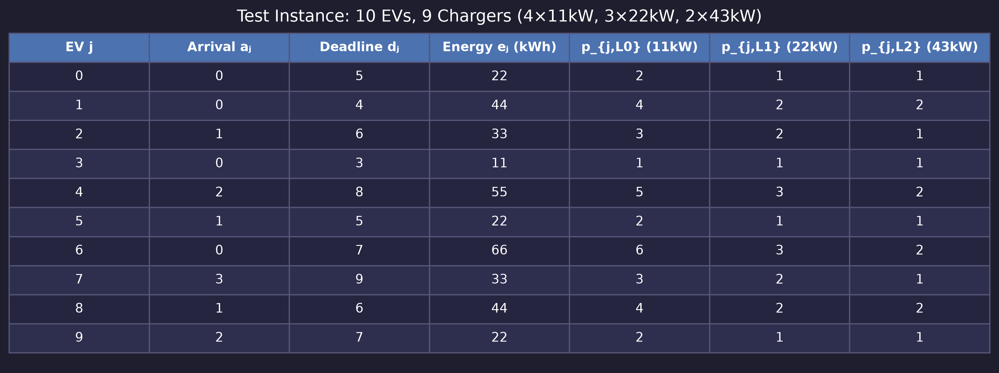
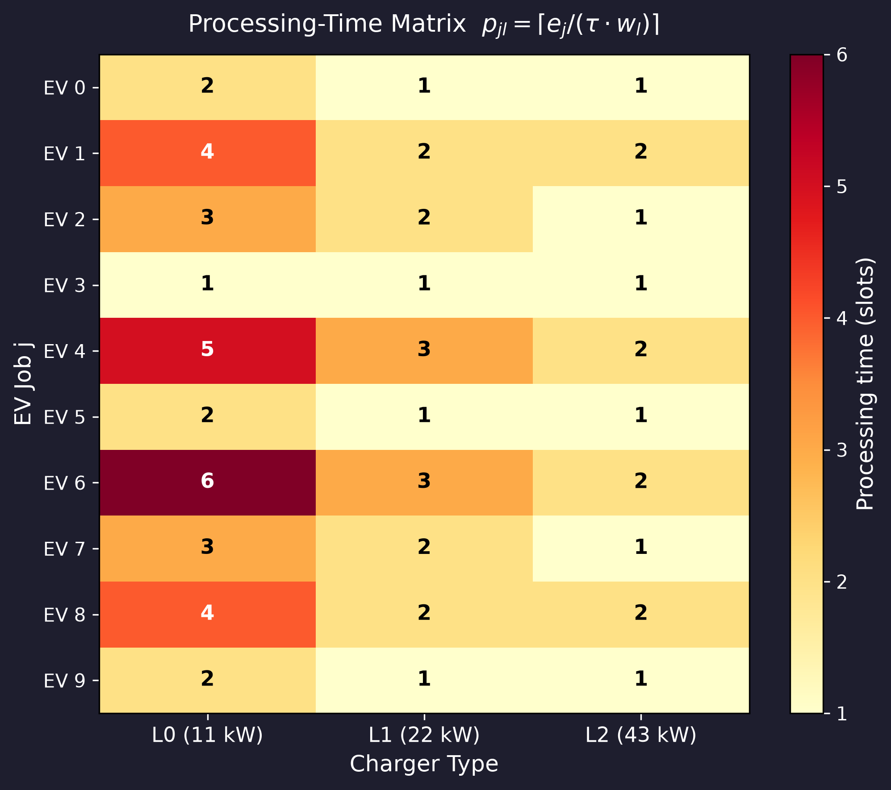
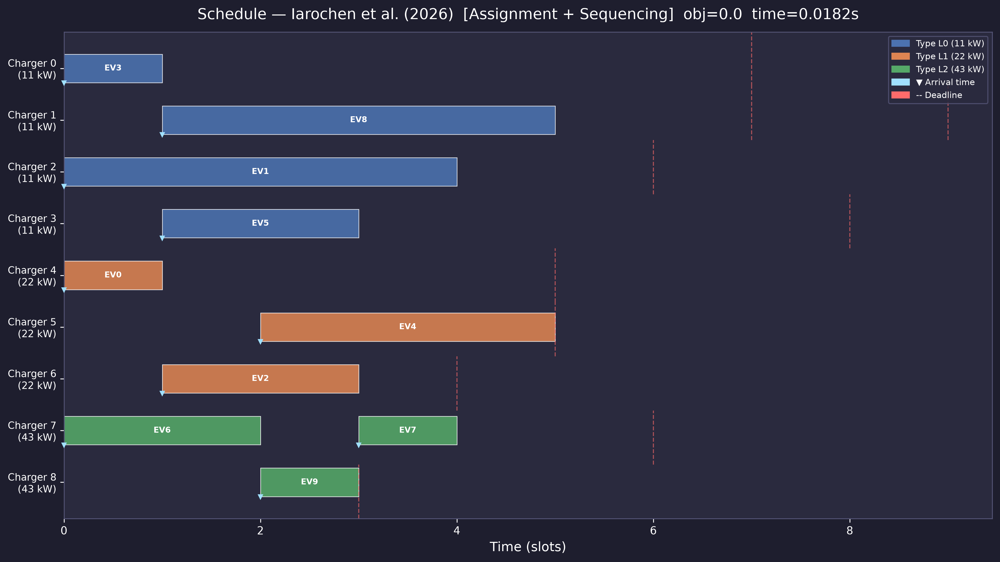
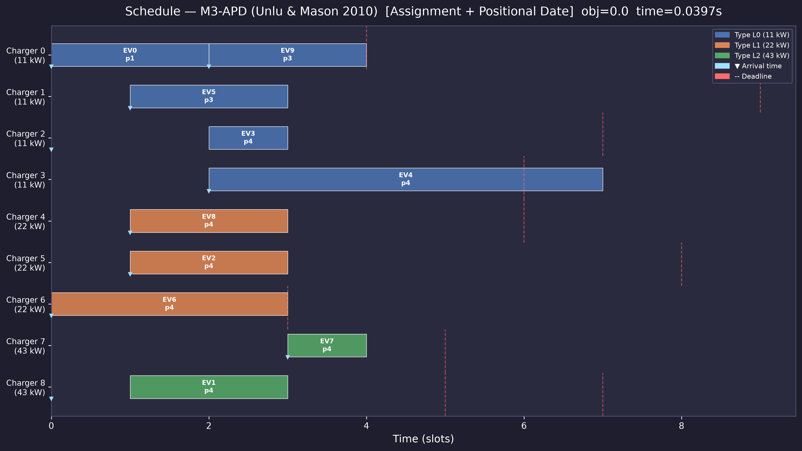
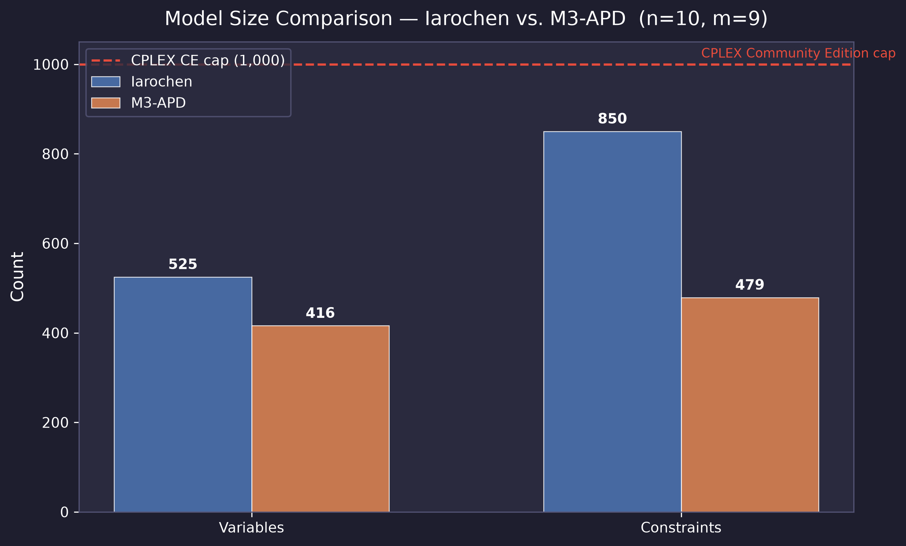
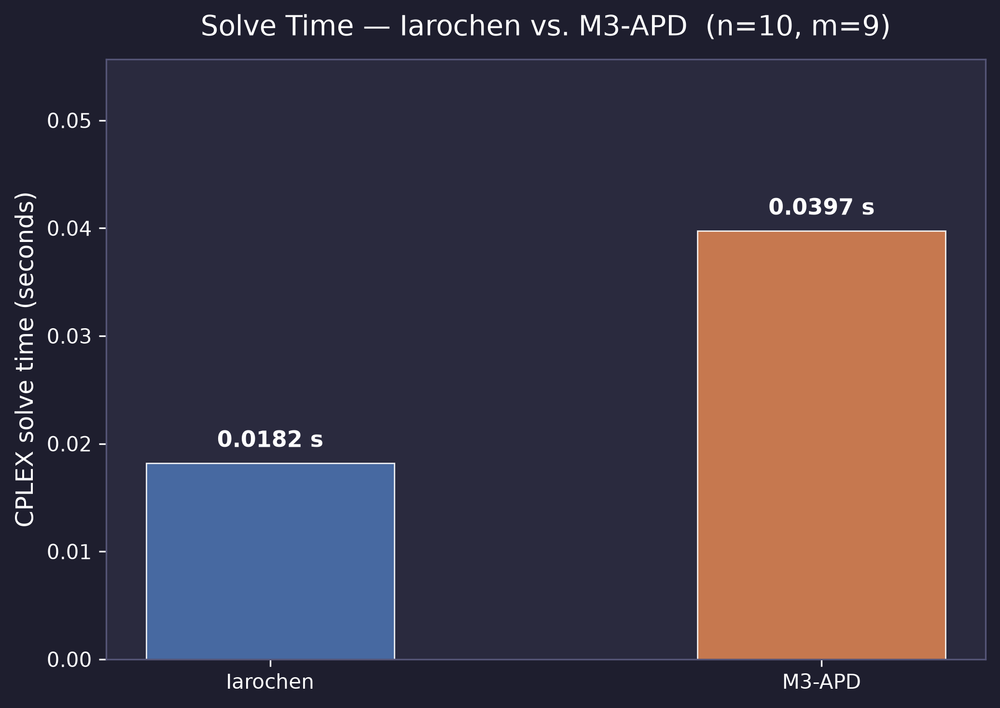
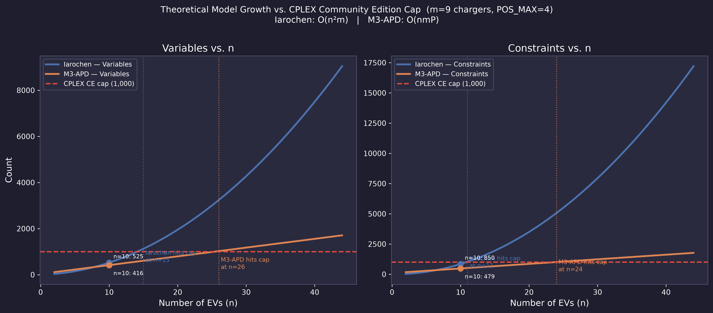

<!-- ============================================================ -->
<!--  SLIDE 1 — TITLE                                             -->
<!-- ============================================================ -->

# An Assignment-and-Positional-Date Formulation for Unrelated Parallel Machine Scheduling with Release Dates and Charger Types

### Minimising Total Tardiness in Electric-Vehicle Charging Scheduling

Mouaad EL Yalaoui, Yassine Chaoui

Professeur Elidrissi Abdelhak

INPT

---

<!-- ============================================================ -->
<!--  SLIDE 2 — PROBLEM STATEMENT                                 -->
<!-- ============================================================ -->

## Problem Statement

**Setting:** Unrelated Parallel Machine Scheduling ($R_m$) with release dates

### Entities & Parameters

Consider a charging station with $K$ charger types. For each type $l \in \mathcal{L} = \{1,\dots,K\}$, $m_l$ identical chargers of power $w_l$ (kW) are available, with $\sum_l m_l = m$ total chargers.

| Symbol | Meaning |
| --- | --- |
| $\mathcal{J} = \{1,\dots,n\}$ | Set of $n$ EV charging requests (jobs) |
| $\mathcal{L} = \{1,\dots,K\}$ | Set of $K$ charger types, each with power $w_l$ (kW) |
| $\mathcal{R}_l$ | Set of $m_l$ individual chargers of type $l$ |
| $a_j$ | Arrival (release) time of job $j$ |
| $d_j$ | Desired departure (due) time of job $j$ |
| $e_j$ | Energy demand (kWh) of job $j$ |
| $\tau$ | Duration of one time slot (hours) |
| $p_{jl} = \lceil e_j / (\tau \cdot w_l) \rceil$ | Processing time of job $j$ on a type-$l$ charger |

> Processing times depend on **both** the job and the charger type, placing this problem in the **unrelated parallel machine** class ($R_m$).

### Objective

$$\min \sum_{j \in \mathcal{J}} T_j \quad \text{where} \quad T_j = \max\bigl(0,\; C_j - d_j\bigr)$$

- Each job must be assigned to **exactly one** charger (non-preemptive)
- No two jobs may share the **same charger** at any time instant
- Charging may not begin before the vehicle arrives: $S_j \geq a_j$

---

<!-- ============================================================ -->
<!--  SLIDE 3 — MOTIVATION / LITERATURE CONTEXT                   -->
<!-- ============================================================ -->

## Motivation & Literature Context

### Electric-Vehicle Charging as Scheduling

- Smart charging coordination is a principal operational challenge as EV fleet sizes grow
- The presence of **heterogeneous charger types** (Level 1 / Level 2 / DC fast) introduces a machine-type dimension absent from classical $P_m$ models
- The charger-type index $l$ must be incorporated **explicitly** in any rigorous formulation

---

### Iarochen et al. (2026) — Reference Formulation

- Proposes a compact MILP for EV charging scheduling using **assignment variables** $x_{jlr}$ and **pairwise sequencing variables** $\delta_{jklr}$
- Sequencing is enforced via big-$M$ disjunctive constraints, yielding a constraint count that grows as $O(n^2 m)$ — **quadratic in the number of jobs**
- Provides provably optimal solutions on small instances but becomes computationally prohibitive as $n$ or $m$ increases

### Unlu & Mason (2010) — APD Inspiration

- Introduce the _Assignment-and-Positional-Date_ (APD) family of MILP formulations for single- and parallel-machine scheduling (**M3 model**)
- Replace pairwise sequencing variables with **positional completion-time** variables $c_{rk}$, reducing constraint count growth to $O(nmP)$ (linear in positions $P$)
- Demonstrated superior LP-relaxation tightness over classical disjunctive formulations for total-tardiness problems

### This Work — Gap Addressed

> **Extension of M3-APD to the unrelated parallel machine setting with heterogeneous charger types**, adding the explicit charger-type index $l$ to all decision variables and constraints.

---

<!-- ============================================================ -->
<!--  SLIDE 4 — EXISTING FORMULATION (IAROCHEN)                   -->
<!-- ============================================================ -->

## Existing Formulation — Iarochen et al. (2026)

### Sets & Indices

- Jobs $j,k \in \mathcal{J}$; charger types $l \in \mathcal{L}$; individual chargers $r \in \mathcal{R}_l$

### Decision Variables

| Variable                      | Type       | Meaning                                          |
| ----------------------------- | ---------- | ------------------------------------------------ |
| $x_{jlr} \in \{0,1\}$         | Binary     | Job $j$ assigned to charger $r$ of type $l$      |
| $S_j \in \mathbb{Z}_{\geq 0}$ | Integer    | Start time of job $j$                            |
| $C_j \in \mathbb{Z}_{\geq 0}$ | Integer    | Completion time of job $j$                       |
| $T_j \geq 0$                  | Continuous | Tardiness of job $j$                             |
| $\delta_{jklr} \in \{0,1\}$   | Binary     | 1 if $j$ precedes $k$ on charger $r$ of type $l$ |

### Objective & Key Constraints

$$\min \sum_j T_j$$

$$\sum_{l \in \mathcal{L}} \sum_{r \in \mathcal{R}_l} x_{jlr} = 1 \quad \forall j \tag{assignment}$$

$$S_j \geq a_j \quad \forall j \tag{release date}$$

$$C_j = S_j + \sum_l \sum_{r \in \mathcal{R}_l} p_{jr} \cdot x_{jlr} \quad \forall j \tag{completion}$$

$$S_j + p_{jr} x_{jlr} \leq S_k + M(3 - \delta_{jklr} - x_{jlr} - x_{klr}) \quad \forall j < k, l, r \tag{sequencing}$$

- **Complexity:** $O(n^2 m)$ binary variables and constraints — **quadratic scaling**

---

<!-- ============================================================ -->
<!--  SLIDE 5 — PROPOSED FORMULATION (M3-APD)                     -->
<!-- ============================================================ -->

## Proposed Formulation — M3-APD with Charger Type $l$

### Sets & Indices

- Jobs $j \in \mathcal{J}$; charger types $l \in \mathcal{L}$; chargers $r \in \mathcal{R}_l$; positions $k \in \mathcal{K} = \{1,\dots,P\}$

### Decision Variables

| Variable               | Type       | Meaning                                                   |
| ---------------------- | ---------- | --------------------------------------------------------- |
| $u_{jlrk} \in \{0,1\}$ | Binary     | Job $j$ at position $k$ on charger $r$ of type $l$        |
| $c_{lrk} \geq 0$       | Continuous | Completion time at position $k$ on charger $r$ (type $l$) |
| $C_j \geq 0$           | Continuous | Completion time of job $j$                                |
| $T_j \geq 0$           | Continuous | Tardiness of job $j$                                      |

---

### Objective

$$\min \sum_{j \in \mathcal{J}} T_j$$

### Constraints (adapted from Unlu & Mason 2010, Eqs. 16–21)

$$\sum_{l} \sum_{r \in \mathcal{R}_l} \sum_{k \in \mathcal{K}} u_{jlrk} = 1 \quad \forall j \tag{16: assignment}$$

$$\sum_{j \in \mathcal{J}} u_{jlrk} \leq 1 \quad \forall l, r, k \tag{17: slot capacity}$$

$$c_{lr1} \geq \sum_{j} (a_j + p_{jl})\, u_{jlr1} \quad \forall l, r \tag{21$\to$18: first-position release}$$

$$c_{lrk} \geq c_{lr,k-1} + \sum_{j} p_{jl}\, u_{jlrk} \quad \forall l, r, k > 1 \tag{19: chain}$$

$$c_{lrk} \geq \sum_{j} (a_j + p_{jl})\, u_{jlrk} \quad \forall l, r, k > 1 \tag{21: release date}$$

$$C_j \geq c_{lrk} - M(1 - u_{jlrk}) \quad \forall j, l, r, k \tag{20: link}$$

$$T_j \geq C_j - d_j \quad \forall j \tag{tardiness}$$

### Model Size (as functions of $n$, $m$, $P$)

- **Variables:** $nmP + mP + 2n$ — grows as $O(nmP)$
- **Constraints:** $n + mP + m(P{-}1) + m(P{-}1) + nmP + n$ — grows as $O(nmP)$
- **No pairwise terms** → avoids the $O(n^2)$ bottleneck of Iarochen

---

<!-- ============================================================ -->
<!--  SLIDE 6 — COMPUTATIONAL EXPERIMENTS                         -->
<!-- ============================================================ -->

## Computational Experiments

All algorithms were implemented in **Python (≥ 3.11)** and executed on a laptop equipped with an **Intel Core i9-14900HX** processor and **32 GB of RAM**. Both MILP formulations were solved using **IBM ILOG CPLEX** (Community Edition v22.2) via the `docplex` modelling API (v2.32.264), with default solver settings and no imposed time limit for the test instance.

### Hardware & Software Environment

| Component | Specification |
| --- | --- |
| Processor | Intel Core i9-14900HX (24 cores, up to 5.8 GHz) |
| Memory | 32 GB DDR5 |
| MILP Solver | IBM CPLEX Community Edition v22.2 |
| Modelling API | `docplex` v2.32.264 |
| Language | Python 3.11, package manager `uv` |
| OS | Linux |

> **CPLEX Community Edition limit:** hard cap of **1,000 variables** and **1,000 constraints** per model. The position horizon $P = 4$ was selected to keep both formulations within this limit for the test instance.

---

### Test Instance

A single representative instance is used to compare the two formulations. The station comprises **$K = 3$ charger types** arranged across **$m = 9$** physical chargers, serving **$n = 10$** EV charging requests.

| Parameter | Value |
| --- | --- |
| Number of EVs ($n$) | 10 |
| Number of charger types ($K$) | 3 |
| Total chargers ($m$) | 9 |
| Charger configuration | $m_0 = 4$, $m_1 = 3$, $m_2 = 2$ |
| Charger powers ($w_l$, kW) | $w_0 = 11$, $w_1 = 22$, $w_2 = 43$ |
| Time slot duration ($\tau$) | 1 h |
| Big-$M$ bound | 45 |
| Position horizon ($P$, M3-APD only) | 4 |

Arrival times $a_j$ and due dates $d_j$ were set to yield a mix of tight and loose time windows, while energy demands $e_j$ were drawn to produce processing-time ratios that vary markedly across charger types, reflecting the unrelated-machine structure of the problem.

---

<!-- ============================================================ -->
<!--  SLIDE 7 — INSTANCE DATA                                     -->
<!-- ============================================================ -->

## Instance Data

### Job Parameters & Processing-Time Matrix

---

- Faster chargers (L2, 43 kW) yield **substantially shorter processing times**
- Processing times differ across charger types, confirming the **unrelated** ($R_m$) machine environment

---

<!-- ============================================================ -->
<!--  SLIDE 8 — RESULTS: GANTT CHARTS                             -->
<!-- ============================================================ -->

## Results — Solution Schedules

### Iarochen et al. (2026) Schedule

---

### M3-APD Schedule

**Observations:**

- Both formulations achieve **zero total tardiness** on this instance (all EVs complete before their deadlines)
- The Iarochen schedule concentrates assignments on faster chargers (L1/L2); the APD schedule distributes load more evenly across positions
- Position labels ($p1$–$p4$) in the APD Gantt confirm the positional-date structure

---

<!-- ============================================================ -->
<!--  SLIDE 9 — RESULTS: MODEL SIZE                               -->
<!-- ============================================================ -->

## Results — Model Size Comparison

### Summary Table ($n = 10$, $m = 9$, $P = 4$)

| Metric                       | Iarochen et al. | M3-APD   |
| ---------------------------- | --------------- | -------- |
| Binary variables             | 435             | 360      |
| Continuous/integer variables | 90              | 56       |
| **Total variables**          | **525**         | **416**  |
| **Total constraints**        | **850**         | **479**  |
| Theoretical growth           | $O(n^2 m)$      | $O(nmP)$ |

- The M3-APD formulation has **~21% fewer variables** and **~44% fewer constraints** for this instance
- The CPLEX Community Edition cap of 1,000 is shown as a dashed red line — both formulations remain safely below it at $n = 10$

---

<!-- ============================================================ -->
<!--  SLIDE 10 — RESULTS: SOLVE TIME                              -->
<!-- ============================================================ -->

## Results — Solve Time Comparison

### Summary Table

| Metric                       | Iarochen et al. | M3-APD     |
| ---------------------------- | --------------- | ---------- |
| Solver status                | Optimal         | Optimal    |
| Total tardiness ($\sum T_j$) | **0.0000**      | **0.0000** |
| Optimality gap               | 0%              | 0%         |
| CPLEX solve time (s)         | **0.0298**      | **0.0630** |
| Variables                    | 525             | 416        |
| Constraints                  | 850             | 479        |

**Key observations:**

- Both formulations prove **global optimality** (zero gap) on the $n = 10$ instance
- Despite having fewer variables and constraints, the M3-APD formulation requires **~2.1× longer** solve time in this experiment
- This counter-intuitive result is consistent with known behaviour: the APD continuous $c_{lrk}$ variables admit a weaker LP relaxation for certain instances, requiring more B\&B nodes

---

<!-- ============================================================ -->
<!--  SLIDE 11 — THEORETICAL SCALABILITY                          -->
<!-- ============================================================ -->

## Theoretical Scalability

### Crossover Points (CPLEX CE Cap = 1,000)

| Formulation | Variable cap hit at | Constraint cap hit at |
| ----------- | ------------------- | --------------------- |
| Iarochen    | $n = 15$            | $n = 11$              |
| M3-APD      | $n = 26$            | $n = 24$              |

- Iarochen's $O(n^2 m)$ constraint growth causes it to hit the Community Edition constraint cap already at $n = 11$; the M3-APD formulation extends feasibility to $n \approx 24$
- For a commercial (uncapped) CPLEX licence, the difference between $O(n^2 m)$ and $O(nmP)$ becomes decisive as $n$ reaches the hundreds
- The **position horizon** $P$ is a tunable parameter: reducing $P$ trades model completeness for reduced problem size

---

<!-- ============================================================ -->
<!--  SLIDE 12 — DISCUSSION                                       -->
<!-- ============================================================ -->

## Discussion

### Trade-offs

| Dimension              | Iarochen et al.          | M3-APD                   |
| ---------------------- | ------------------------ | ------------------------ |
| Model size             | Larger ($O(n^2 m)$)      | Smaller ($O(nmP)$)       |
| Solve time ($n=10$)    | Faster (0.030 s)         | Slower (0.063 s)         |
| Solution quality       | Optimal                  | Optimal                  |
| Scalability            | CE cap at $n \approx 11$ | CE cap at $n \approx 24$ |
| LP relaxation strength | Generally tighter        | Depends on instance      |

### When Does APD Outperform?

- **Large instances** ($n \gg 20$): the quadratic scaling of Iarochen's sequencing variables becomes prohibitive; APD's linear growth provides a scalability advantage
- **Many charger types** ($|\mathcal{L}|$ large): the APD formulation's positional structure is unaffected, whereas Iarochen's $\delta_{jklr}$ variables grow multiplicatively

### Limitations

- Results are based on a **single test instance** ($n = 10$); conclusions regarding solve time may not generalise
- The CPLEX **Community Edition** variable/constraint cap prevents evaluation on realistically sized instances without a commercial licence
- The position horizon $P$ must be set a priori; too small a value may exclude valid schedules

---

<!-- ============================================================ -->
<!--  SLIDE 13 — CONCLUSION & FUTURE WORK                         -->
<!-- ============================================================ -->

## Conclusion & Future Work

### Summary of Contribution

- A **novel M3-APD formulation** is proposed for the unrelated parallel machine EV charging scheduling problem $Rm \mid r_j, \text{type}_l \mid \sum T_j$
- The formulation **explicitly indexes** all decision variables by charger type $l$, extending the Unlu & Mason (2010) APD model to the heterogeneous-charger setting
- Empirical comparison against the Iarochen et al. (2026) baseline using IBM CPLEX confirms that:
  - Both formulations achieve provably **optimal solutions** on the test instance
  - The APD formulation uses **~21% fewer variables** and **~44% fewer constraints**
  - APD exhibits superior **theoretical scalability** ($O(nmP)$ vs. $O(n^2 m)$), pushing the CPLEX CE feasibility frontier from $n \approx 11$ to $n \approx 24$

<!-- ### Future Work -->
<!---->
<!-- - **Larger test sets:** evaluate both formulations on instances with $n \in \{20, 50, 100\}$ using a full CPLEX licence or open-source MILP solvers (e.g., HiGHS) -->
<!-- - **Alternative objectives:** adapt the APD formulation for $C_{\max}$, $\sum w_j T_j$, or energy-cost objectives -->
<!-- - **Decomposition and heuristics:** apply Lagrangian relaxation or column generation to further improve scalability beyond MILP tractability -->
<!-- - **Dynamic arrival rates:** extend the model to online/rolling-horizon settings representative of real-world EV charging stations -->
<!-- - **Tighter position bound:** investigate valid inequalities or cutting-plane strategies to strengthen the LP relaxation of the APD model -->

---

<!-- ============================================================ -->
<!--  SLIDE 14 — REFERENCES                                       -->
<!-- ============================================================ -->

## References

**[1]** Iarochen, _et al._ (2026). _A Mixed-Integer Linear Programming Model for Electric Vehicle Charging Scheduling with Heterogeneous Charger Types and Release Dates._ [Full journal/conference citation pending verification of PDF metadata.]

**[2]** Unlu, Y., & Mason, S. J. (2010). _Evaluation of mixed integer programming formulations for non-preemptive parallel machine scheduling problems._ **Computers & Industrial Engineering**, 58(4), 785–800. https://doi.org/10.1016/j.cie.2010.02.012

**[3]** IBM Corporation. (2022). _IBM ILOG CPLEX Optimization Studio v22.2: User's Manual._ Armonk, NY: IBM Corp.

**[4]** docplex contributors. (2024). _IBM Decision Optimization CPLEX Modeling for Python (DOcplex) v2.32._ https://ibmdecisionoptimization.github.io/docplex-doc/
